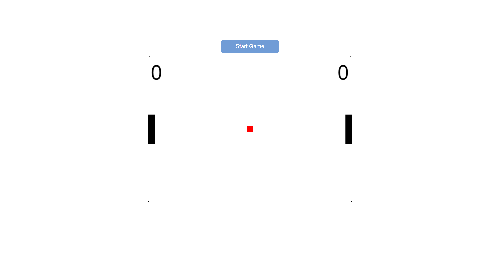

# Ping-pong game

> This is my first attempt on creating a web game! This Ping-pong game was built with HTML CSS and JS. The game was created using the HTML canvas tag. I used class syntax to create all the functionalities and animations. In this game your adversary is a bot, and there's no points limits.

🔗 [Click here to play](https://caiomiyaji.github.io/ping-pong-game/)

## ⚒ Used technologies:
- HTML 
- CSS 
- JavaScript

## 😎 Contact me:

c.hidekimiyaji@gmail.com
